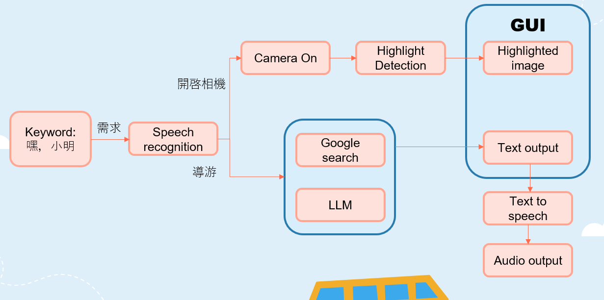

# Incar AI Assistant 🚗🤖

An intelligent in-car AI assistant that combines voice interaction, personalized travel scheduling, and smart camera technology to enhance your driving experience.

## 🌟 Features

- **🎤 Voice Interaction**: Real-time speech recognition (ASR) and text-to-speech (TTS) capabilities
- **📅 Personalized Travel Scheduling**: AI-powered trip planning using LangChain and LLM integration
- **📸 Smart Camera Integration**: Automatic landmark detection and highlight capture using Moment-DETR
- **🖥️ Interactive GUI**: PyQt5-based graphical interface
- **🎥 Video Recording**: Intelligent video capture with moment detection

## 🏗️ System Architecture



### Workflow Description

1. **Voice Input**: User speaks keywords like "喂，小明" (Hey, Xiao Ming) to trigger the system
2. **Speech Recognition**: Converts voice input to text using Google Speech Recognition API
3. **Dual Processing Path**:
   - **Camera Path**: Keywords like "開啟相機" activate camera system → Moment-DETR highlight detection → Highlighted image capture
   - **AI Assistant Path**: Travel queries trigger Google Search + LLM processing for intelligent responses
4. **Unified GUI**: PyQt5 interface manages both camera and AI assistant outputs
5. **Response Generation**: Text output converted to speech via TTS and played as audio

## 🚀 Quick Start

### Prerequisites

**System Requirements:**
```bash
# For Ubuntu/Debian
sudo apt-get install portaudio19-dev
sudo apt-get install libportaudio2  
sudo apt-get install libasound-dev
```

**Python Dependencies:**
```bash
pip install -r requirements.txt
```

### Installation

1. **Clone the repository:**
```bash
git clone https://github.com/yourusername/Incar_AI_assistant.git
cd Incar_AI_assistant
```

2. **Set up environment variables:**
```bash
# Create .env file with your API keys
echo "GOOGLE_GEMINI_KEY=your_api_key_here" > .env
```

3. **Install dependencies:**
```bash
pip install -r requirements.txt
```

### Running the Application

**GUI Mode (Recommended):**
```bash
python GUI_FINAL.py
```

**Command Line Mode:**
```bash
python main.py
```

## 🎯 Usage Examples

### Voice Commands
- **Travel Planning**: "帮我规划明天的行程" (Help me plan tomorrow's itinerary)
- **Camera Activation**: "启动相机" (Start camera) / "开启拍照" (Enable photo mode)

### Smart Camera Features
The integrated Moment-DETR model automatically detects and captures interesting moments during your drive, such as:
- Scenic landmarks
- Notable buildings
- Points of interest

### AI Travel Assistant
Powered by LangChain and LLM, the assistant can:
- Create personalized travel schedules
- Suggest optimal routes
- Provide real-time travel recommendations

## 🔧 Core Components

### 1. Voice Processing (`GUI_FINAL.py`)
- **Speech Recognition**: Google Speech Recognition API
- **Text-to-Speech**: Google TTS (gTTS)
- **Audio Processing**: Real-time voice command processing

### 2. AI Tutor (`Tutor/`)
- **LangChain Integration**: Advanced language model processing
- **Smart Scheduling**: Personalized travel plan generation
- **Context Understanding**: Natural language query processing

### 3. Camera System (`Camera/`, `moment_detr/`)
- **Video Recording**: High-quality video capture
- **Moment Detection**: AI-powered highlight identification
- **Landmark Recognition**: Automatic point-of-interest detection

## 📁 Project Structure

```
Incar_AI_assistant/
├── 🎮 GUI_FINAL.py              # Main GUI application
├── 💻 main.py                   # CLI interface
├── 📋 requirements.txt          # Dependencies
├── 📖 README.md                 # Documentation
├── 📷 Camera/
│   └── VideoRec.py             # Video recording functionality
├── 🤖 moment_detr/             # Moment-DETR model implementation
├── 🎥 run_on_video/            # Video processing pipeline
├── 🎓 Tutor/                   # AI assistant backend
│   ├── tutor.py               # Main tutor logic
│   └── search.py              # Search functionality
└── 🛠️ utils/                   # Utility functions

```

## 📚 References

### Academic Papers
- **Moment-DETR**: Lei Jie, et al. "[QVHighlights: Detecting Moments and Highlights in Videos via Natural Language Queries](https://arxiv.org/abs/2107.09609)." *NeurIPS 2021*.

### External Libraries & Tools
- **Feature Extraction**: [HERO Video Feature Extractor](https://github.com/linjieli222/HERO_Video_Feature_Extractor) by Linjie Li
- **LangChain**: Framework for developing applications with language models
- **PyQt5**: Cross-platform GUI toolkit
- **OpenCV**: Computer vision library
- **Google Speech Recognition & TTS**: Voice processing services

### Model Credits
- **CLIP**: OpenAI's Contrastive Language-Image Pre-training
- **Moment-DETR**: Video moment detection and highlight detection model

